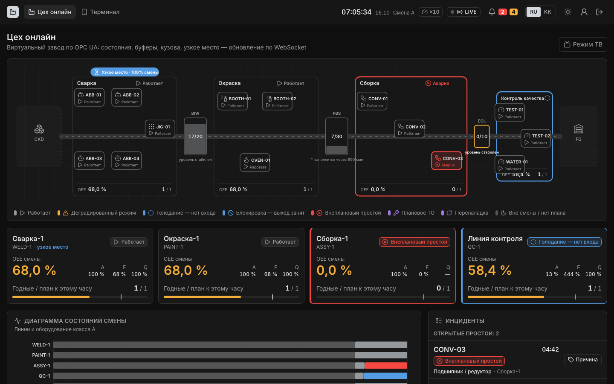
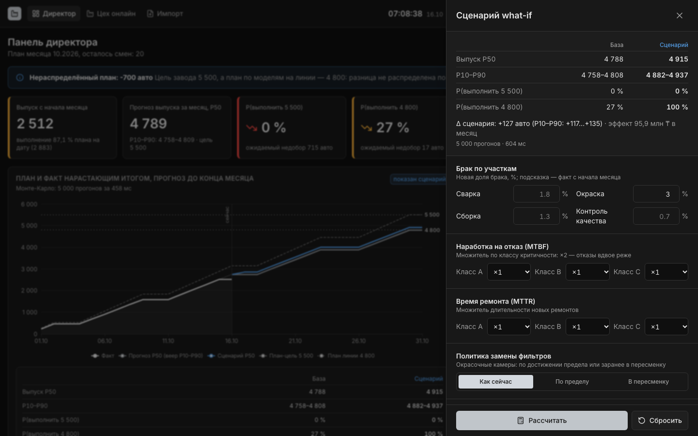
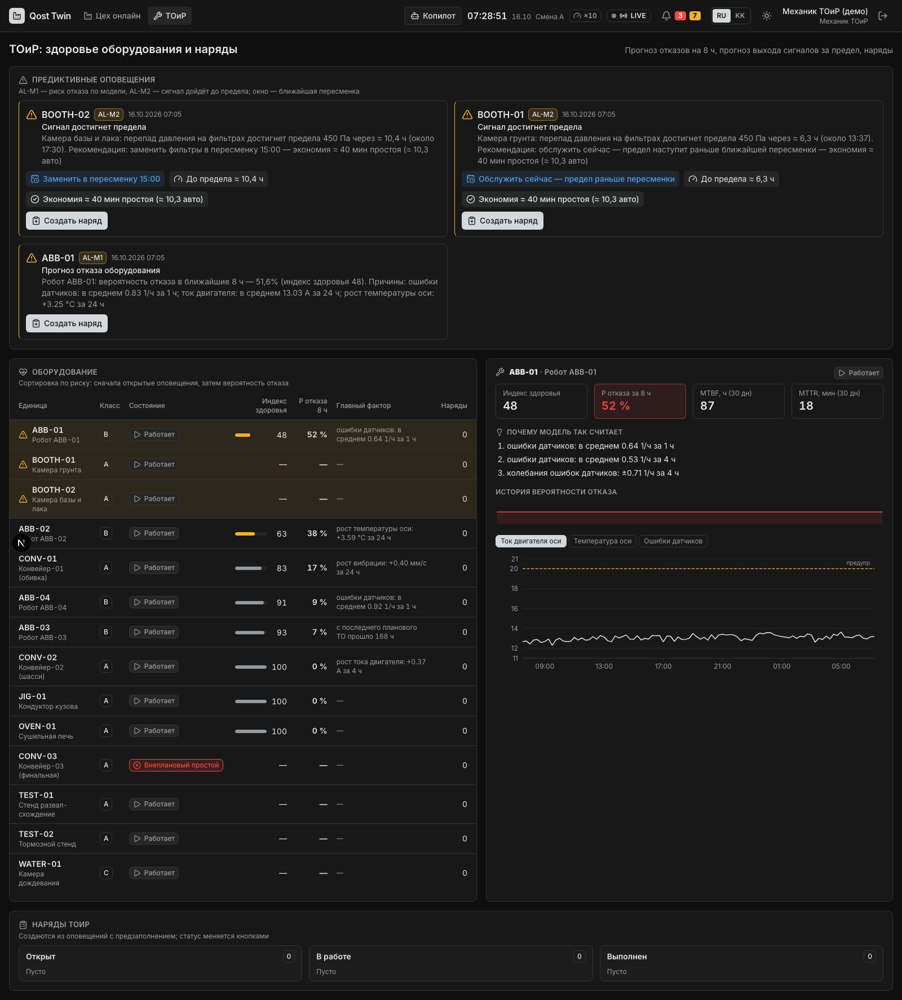
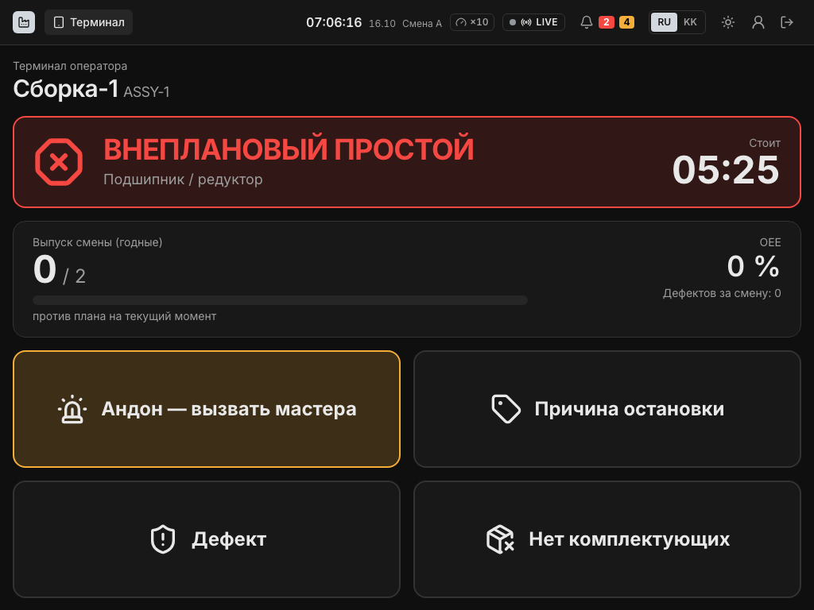

# Aina — цифровой двойник автомобильного завода

**Кейс 2 «Цифровой двойник автомобильного завода» · Qostanai Industry Hackathon · организатор кейса — АО «Группа компаний АЛЛЮР» · Demo Day 16.10.2026**

Aina показывает цех в реальном времени, считает KPI по ISO 22400, находит узкое место, предупреждает об отказах оборудования за 8 часов и прогнозирует выполнение плана месяца с what-if. Данные приходят от виртуального завода по OPC UA и MQTT — так же, как от контроллеров. Для пилота достаточно заполнить карту тегов и указать адрес OPC UA-сервера завода.

▶ **[Демо-видео (2 мин)](https://github.com/a1murt/aina/releases/download/demo-day/aina-demo.mp4)** · **[Все материалы для сдачи](https://github.com/a1murt/aina/releases/tag/demo-day)** · [Архитектура](docs/ARCHITECTURE.md) · [Сценарий демо](docs/DEMO.md) · [План пилота](docs/PILOT.md)



## Что сдаём (по требованиям кейса)

| Ожидаемый результат | Где |
|---|---|
| Архитектура решения | [docs/ARCHITECTURE.md](docs/ARCHITECTURE.md): ISO 23247, ISA-95, ISO 22400, зоны IEC 62443, OPC UA только на чтение |
| Интерактивный прототип / MVP | этот репозиторий, запуск одной командой `make demo` |
| Демонстрация ключевых сценариев | [демо-видео](https://github.com/a1murt/aina/releases/download/demo-day/aina-demo.mp4), [сценарий на 6 минут](docs/DEMO.md) |
| Оценка эффекта для бизнеса | экран директора («с системой»: ≈ +83 машины и ≈ 67 млн ₸ в месяц, допущения помечены), презентация, [план пилота](docs/PILOT.md) |

## Что умеет

| Требование кейса | Как закрыто |
|---|---|
| Визуализация участков и оборудования | живая SVG-схема цеха: 4 линии, 14 единиц оборудования, буферы, движение кузовов, режим ТВ |
| Мониторинг KPI | OEE = доступность × эффективность × качество (ISO 22400), выпуск против плана, простои, брак по участкам |
| Инциденты и отклонения | оповещения с оценкой потерь в машинах, эскалация, Telegram; терминал оператора: андон и причина остановки в 3 касания |
| Панель руководителя | выпуск с начала месяца, прогноз P10–P90, вероятность плана 4 800 и цели 5 500, топ потерь и рычагов в машинах и ₸ |
| Прогноз простоев и узких мест (ИИ) | LightGBM + SHAP: отказ робота/конвейера за 8 ч с объяснением; время до предела по сигналам; узкое место методом активных периодов; Монте-Карло плана месяца с what-if; SPC и корреляции брака; сменный рапорт ИИ с проверкой каждой цифры |

**Аудит их же данных за секунды.** Загрузка `case2_data.docx` (или xlsx/csv) сразу показывает: брак окраски 5,17% при норме 2%, Конвейер-03 — 55 из 60 допустимых минут простоя, 5 расхождений журнала простоев с потерянным временем, проедание буфера перед сборкой, план 4 800 против цели 5 500. Цель 5 500 недостижима без дополнительных смен: потолок линии ≈ 5 191 машин за 42 смены.

| Директор: прогноз и what-if | ТОиР: прогноз отказов | Терминал оператора |
|---|---|---|
|  |  |  |

## Цифры (измерено)

| Показатель | Результат |
|---|---|
| Изменение тега OPC UA → экран, p95 | 0,79 с (требование ≤ 2 с) |
| Обрыв связи с БД на 60 с | 0 потерянных событий |
| `make demo` с нуля: сборка, миграции, история с 01.09, импорт кейса, live | ≈ 2,5–3 мин |
| Прогноз Монте-Карло, 5 000 прогонов, база + сценарий | 0,8 с |
| Прогноз отказов (на синтетике): конвейер / робот | PR-AUC 0,70 / 0,66, ROC-AUC 0,91 / 0,93, упреждение ≈ 3,5 ч |
| Запросы панели директора за месяц, p95 | 83 мс |
| Автотесты | 1 004 unit + 47 интеграционных + 12 сквозных (Playwright) |

## Запуск

Нужны Docker с Compose, `make`, `uv`, Node 20+ и `pnpm`.

```bash
make demo
```

Веб — http://localhost:3000, API — http://localhost:8000/api/docs. Пользователи по ролям: `director`, `master`, `operator`, `maintenance`, `quality`, `admin`, пароль `qost2026`. Сброс к началу демо — `make demo-reset`, сценарии S1–S5 — на экране `/demo`. Всё работает без интернета.

Исходные файлы кейса от организатора в репозиторий не выложены. Если положить их в `data/case/source/`, `make demo` импортирует docx; иначе — XLSX-копию тех же данных с тем же результатом.

## Стек и стандарты

Python 3.12 (FastAPI, SimPy, asyncua, LightGBM, SHAP, NumPy), TimescaleDB, Redis, Mosquitto, Next.js 15 + ECharts, Docker Compose. ISO 23247 (цифровой двойник), ISA-95 (модель активов), ISO 22400 (KPI), OPC UA и MQTT UNS, IEC 62443 (двойник в DMZ, только чтение из OT), ISA-101 (HMI).

| Каталог | Что |
|---|---|
| `services/sim` | виртуальный завод: модель потока, отказы и износ, брак, телеметрия, OPC UA-сервер, MQTT, пульт сценариев |
| `services/collector` | сбор по OPC UA/MQTT только на чтение, буфер на диске при обрыве связи |
| `services/engine` | состояния, простои, KPI, узкое место, сверка данных, оповещения, прогноз отказов |
| `services/api` | REST + WebSocket, роли, импорт, прогноз, LLM-рапорты, копилот |
| `services/notifier` | Telegram-бот оповещений |
| `packages/twin_core` | общее ядро: конфиг завода, KPI, календарь, правила, прогноз |
| `ml/` | датасет, обучение и модели предиктивного ТО |
| `web/` | веб-интерфейс по ролям |
| `config/` | модель завода, пороги, причины, дефекты, параметры симуляции, бизнес-допущения |
| `docs/` | архитектура, сценарий демо, план пилота, ТЗ, журнал решений |
