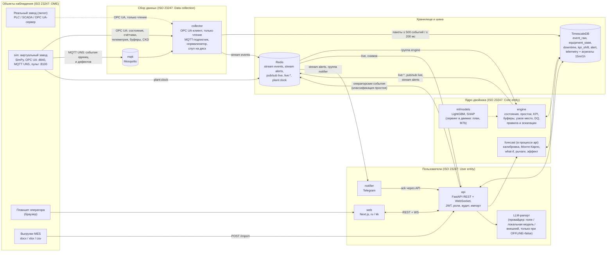
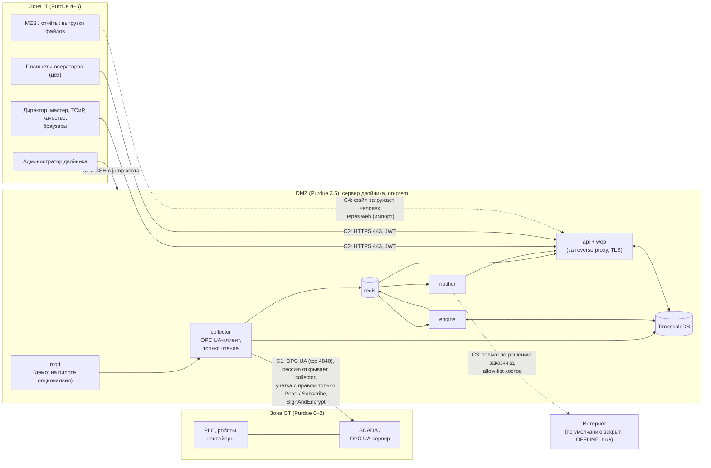

# Aina — архитектура

Документ описывает то, что **реализовано** в репозитории, и отдельно помечает то, что в плане. Источники: `docs/SPEC.md` (требования), `docs/PROGRESS.md` (журнал этапов, решения, замеры), `config/*.yaml`, `docker-compose.yml`. Состояние на 08.10.2026; актуальный статус этапов — всегда в `docs/PROGRESS.md`.

## 1. Что это за система

Цифровой двойник автомобильного завода (кейс 2, Qostanai Industry Hackathon), рассчитанный на пилот на одной линии. Двойник **наблюдающий и советующий**: берёт данные из OT только на чтение, считает KPI по ISO 22400, ведёт модель потока, прогнозирует выполнение плана месяца, объясняет потери и риски. Обратной связи в управление оборудованием нет — это осознанное решение (запись в контроллеры вне скоупа, SPEC §1.4).

В демо данные приходят от **виртуального завода** (`services/sim`, SimPy), который публикует их по OPC UA и MQTT так же, как контроллеры. Переход на реальный завод: заполнить `config/tag_map.yaml`, указать адрес OPC UA-сервера, `CLOCK_MODE=system`, профиль `prod` (без `sim`).

### Состояние реализации (по `docs/PROGRESS.md`)

| Блок | Этап | Статус |
|---|---|---|
| Каркас, конфиг, часы, миграции | M0 | готово |
| KPI ISO 22400, сверка данных (DQ), правила, импорт docx/xlsx/csv, golden-тесты | M1 | готово |
| Виртуальный завод: SimPy, OPC UA, MQTT, пульт, сценарии S1–S5 | M2 | готово |
| Коллектор (спул, только чтение) и движок (состояния, простои, live-KPI, узкое место, DQ, оповещения) | M3 | готово |
| API: JWT, роли, эндпоинты P0, WebSocket, seed, `make demo` | M4 | готово |
| Прогноз: калибровка, Монте-Карло, what-if, рычаги, эффект (бэкенд) | M6 | готово; режим `des` не реализован (501) |
| ML: датасет, обучение, SHAP-тексты, SPC, корреляции, время до предела | M7 | офлайн-часть готова; сервинг в движке, AL-M1/M2/Q2, эндпоинты и экраны `/maintenance`, `/quality` — **не сделаны** (M7b) |
| LLM-рапорт с проверкой чисел, Telegram-бот | M8 | готово; копилот и экран `/reports` — **не сделаны** |
| Веб-интерфейс (экраны) | M5 | по журналу «не начат» на 08.10.2026; ведётся отдельным потоком — сверяться с `PROGRESS.md` |
| Перемотка истории, `/data-quality`, `/admin`, нагрузочный тест T-LOAD, DES | M9 | не сделано |

## 2. Сервисы и поток данных

### Как это работает по шагам

1. **Источник.** `sim` держит модель завода (линии WELD-1, PAINT-1, ASSY-1, QC-1, 14 единиц оборудования, буферы BIW/PBS/EOL) и публикует её по OPC UA (`ns=2;s=KST.{AREA}.{LINE}.{EQUIPMENT}.{SIGNAL}`) и в MQTT UNS (`qost/v1/KST/{AREA}/{LINE}/{EQUIPMENT}/{signal}`). Скрытое состояние износа `Degradation` есть только в OPC UA как «оракул» для проверок и **не** попадает ни в tag map, ни в MQTT, ни в аналитику (FR-SIM-02; коллектор отбрасывает такие узлы даже при ошибочной карте).
2. **Сбор.** `collector` подписывается на узлы по `tag_map` (в демо — сгенерированный `config/tag_map.demo.yaml`, на пилоте — `config/tag_map.yaml`). Состояния, тревоги, телеметрия, буферы, CKD идут из OPC UA; события единиц и дефектов (кузов, модель, код дефекта) — из MQTT (`COLLECTOR_UNITS=mqtt`). `State` и `AlarmCode` с одной меткой времени склеиваются в одно событие. Нормализатор приводит всё к единой схеме `twin_core.events` (ULID, `ts` источника, `received_ts` коллектора). Неизвестный узел, топик или значение — не падение, а предупреждение и DQ-07.
3. **Запись.** Каждое событие пишется (а) в TimescaleDB пакетами и (б) в Redis Stream `events`. У каждого выхода свой дисковый спул.
4. **Ядро.** `engine` читает поток группой `engine`, строит интервалы состояний, простои и микроостановки, live-KPI смены, закрывает смены (новая версия `kpi_shift` при позднем событии или переклассификации), считает узкое место методом активных периодов, сверку данных и правила оповещений с эскалациями. Результат — в БД (единственный писатель производных таблиц), в хеши `live:*` и в pub/sub-канал `live`; оповещения — ещё и в поток `alerts`.
5. **API.** `api` читает `live:*` и канал `live` из Redis и отдаёт снимок `GET /api/v1/live/snapshot` и WebSocket `/ws/live` (первое сообщение — `snapshot`, затем дельты не чаще 2 в секунду на тип и сущность). Классификация простоя оператором или мастером — событие `operator` в `event_raw` и в поток `events`: движок остаётся единственным писателем `downtime`.
6. **Пользователи.** `web` (Next.js) работает с API по REST и WS. `notifier` читает поток `alerts` своей группой, рассылает в Telegram по ролям; кнопка «Принять» вызывает `POST /api/v1/alerts/{id}/ack`.
7. **Прогноз.** Выполняется в процессе `api` (поток, до двух одновременно): калибровка по сырым фактам, быстрая модель Монте-Карло, рычаги, эффект. Результат сохраняется в `forecast_run`, действие — в `audit_log`.
8. **Часы.** `sim` пишет в Redis ключ `plant:clock`; все сервисы получают «сейчас» через `twin_core.clock.Clock` (раздел 7).

### Сервисы и порты

| Сервис | Ответственность | Порт |
|---|---|---|
| `sim` (только профиль `demo`) | виртуальный завод, OPC UA-сервер, публикация MQTT, пульт управления; режимы `live`, `backfill`, `ml-dataset` | 4840, 8100 |
| `collector` | подписки OPC UA и MQTT, нормализация, пакетная запись, спул | 8110 (health, внутри сети) |
| `engine` | состояния, простои, KPI, буферы, узкое место, DQ, правила, эскалации | 8120 (health) |
| `api` | REST + WS, JWT, роли, аудит, импорт, прогноз, рапорты, прокси к пульту `sim` | 8000 |
| `notifier` | Telegram-бот: подписка по роли и PIN, доставка, дедупликация, повторы | 8130 (health) |
| `web` | Next.js | 3000 |
| `timescaledb`, `redis`, `mqtt` | PostgreSQL 16 + TimescaleDB, Redis 7, Mosquitto 2 | 5432, 6379, 1883 |

Профили Compose: `demo` — всё, включая `sim`; `prod` — без `sim`, коллектор читает `config/tag_map.yaml`. У каждого сервиса `healthcheck`, `depends_on: service_healthy`, `restart: unless-stopped`; тома `pgdata`, `collector-spool`, `ml-models`. Образы Python-сервисов собираются одним `infra/python.Dockerfile`, процессы запускаются не от root (uid 10001), конфиг монтируется только на чтение.

Стек: Python 3.12 (`uv` workspace, `pydantic` v2, `SQLAlchemy` 2 async, `asyncua`, `aiomqtt`, `FastAPI`, `NumPy`/`SciPy`, `LightGBM`, `SHAP`, `aiogram` 3); Next.js 15, TypeScript strict, Tailwind, shadcn/ui, ECharts, `next-intl`.

## 3. Соответствие ISO 23247

ISO 23247 описывает референсную архитектуру цифровых двойников в производстве. Мы следуем её функциональному разбиению; **формальной сертификации или аудита соответствия нет** — это отображение структуры на стандарт.

| Элемент ISO 23247 | Что в Aina | Где в репозитории |
|---|---|---|
| Observable Manufacturing Elements (OME) | линии, 14 единиц оборудования, буферы, кузова; в демо — виртуальный завод, на пилоте — PLC/SCADA | `config/plant.yaml`, `services/sim` |
| Data collection (сбор данных) | OPC UA-клиент и MQTT-подписчик, нормализация, спул | `services/collector`, `twin_core.events` |
| Device control (управление устройствами) | **сознательно не реализовано**: коллектор и вся аналитика только читают; тест T-RO | `tests/collector/test_t_ro.py` |
| Core entity: operation and management | движок состояний, правила, эскалации, конфигурация, аудит | `services/engine`, `twin_core.rules` |
| Core entity: application and service | KPI, узкое место, сверка данных, прогноз и what-if, предиктивное ТО (офлайн), рапорты | `twin_core.kpi/bottleneck/dq/forecast`, `ml/` |
| Core entity: resource access and interchange | TimescaleDB, Redis, единая схема событий, REST/WS API, импорт | `twin_core.db`, `services/api` |
| User entity | web, терминал оператора, Telegram | `web/`, `services/notifier` |
| Cross-system (безопасность, время) | роли и аудит, `Clock`, режим `OFFLINE` | `qost_api.auth`, `twin_core.clock` |

Связи двойника с физическим миром: физический → цифровой — есть (сбор данных, синхронизация в пределах секунд); цифровой → пользователь — есть (экраны, оповещения, рекомендации); цифровой → физический — **нет по замыслу**. Двойник можно назвать «цифровой тенью с прогнозом и рекомендациями».

## 4. Модель активов ISA-95

Единственный источник правды — `config/plant.yaml`; при старте `api` зеркалирует его в таблицы `asset_*` (справочники для SQL). Коды латиницей UPPER-KEBAB, русские и казахские названия — только в интерфейсе. Внешние названия («Камера-02», «Конвейер-03») сопоставляются кодам через `aliases` без учёта регистра, пробелов, вида тире и «ё».

| Уровень ISA-95 | В модели | Коды |
|---|---|---|
| Предприятие | не моделируется (одно предприятие) | — |
| Площадка (site) | `KST` — автозавод, Костанай, `Asia/Qostanay` | `KST` |
| Участок (area) | склад комплектующих, сварка, окраска, сборка, контроль, склад ГП | `CKD`, `WELD`, `PAINT`, `ASSY`, `QC`, `FG` |
| Линия (line) | порядок потока: CKD → WELD-1 → BIW → PAINT-1 → PBS → ASSY-1 → EOL → QC-1 → FG | `WELD-1`, `PAINT-1`, `ASSY-1`, `QC-1` |
| Оборудование (equipment) | 14 единиц, класс критичности A/B/C | см. ниже |
| Буферы (материальный поток) | ёмкость 20 / 30 / 10 | `BIW`, `PBS`, `EOL` |

| Линия | Оборудование | Класс | Тип |
|---|---|---|---|
| WELD-1 | ABB-01…ABB-04 | B (деградированный режим 50%) | сварочный робот |
| WELD-1 | JIG-01 | A | кондуктор |
| PAINT-1 | BOOTH-01, BOOTH-02 | A | окрасочная камера (фильтры, ΔP) |
| PAINT-1 | OVEN-01 | A | сушильная печь |
| ASSY-1 | CONV-01, CONV-02, CONV-03 | A | конвейер |
| QC-1 | TEST-01, TEST-02 | A | испытательный стенд |
| QC-1 | WATER-01 | C | камера дождевания |

Критичность задаёт влияние на линию: A — остановка единицы = остановка линии; B — линия продолжает на `degraded_capacity` (0,5); C — не влияет (флаг риска качества). Идеальный такт `ict_seconds` = 233 с для сварки, окраски и сборки (200 с — для линии контроля).

Иерархия отражена в адресации: OPC UA `ns=2;s=KST.{AREA}.{LINE}.{EQUIPMENT}.{SIGNAL}`, MQTT Unified Namespace `qost/v1/KST/{AREA}/{LINE}/{EQUIPMENT}/{signal}` (QoS 1, JSON `{ts, value, quality}`), события единиц — `qost/v1/KST/{AREA}/{LINE}/units`. Контракт интеграции с реальным заводом — `config/tag_map.example.yaml` (перечисление состояний, шаблон NodeId, интервал публикации).

Состояния: `RUNNING`, `DEGRADED`, `STARVED`, `BLOCKED`, `DOWN_UNPLANNED`, `DOWN_PLANNED`, `CHANGEOVER`, `IDLE_NO_PLAN`. Состояние линии, если источник его не публикует, выводится из оборудования по приоритетам SPEC §5.3.

## 5. KPI по ISO 22400

Все формулы — чистые функции `twin_core.kpi` (типы, mypy strict, деление на 0 даёт `None`). Модель времени взята из ISO 22400-2; собственная доступность и RTY — расширения проекта.

| Обозначение | Определение |
|---|---|
| POT | плановое время работы: длительность смены по календарю (480 мин) |
| PDOT | плановые простои линии внутри POT (причины с `planned=true`) |
| PBT | POT − PDOT |
| ADOT | внеплановые простои линии не короче порога микроостановки (300 с) |
| ADET | задержки потока: `STARVED` + `BLOCKED` |
| AUST | переналадка |
| APT | PBT − ADOT − ADET − AUST (включает микроостановки и `DEGRADED`) |
| PQ, GQ | выпуск линии (первый выход единицы) и годные с первого прохода |
| PRI | `ict_seconds × cycle_factor(модели)` |

Формулы: **A = APT / PBT**; **E = Σ PRI(PQ) / APT**; **QR = GQ / PQ** (он же FPY линии); **OEE = A × E × QR = Σ PRI(GQ) / PBT** (тождество проверяется тестом); RTY завода = произведение FPY по WELD-1, PAINT-1, ASSY-1, QC-1; MTBF и MTTR — по внеплановым отказам не короче порога. Плановые простои в потери не входят. Потеря ёмкости от внепланового простоя = длительность × (1 − `degraded_capacity`); в «машинах» — минуты × 60 / ICT (пример из данных кейса: Конвейер-03, 55 мин → 14,16 авто).

Два пути расчёта дают одни и те же формулы:

- **по событиям** (live): `engine` строит модель времени из интервалов состояний; текущая смена обновляется не реже раза в 5 с заводского времени; закрытая смена фиксируется как `kpi_shift` с `final=true`, поздние события и переклассификация создают новую версию с аудитом;
- **по импорту** (агрегаты смены без событий): POT = 480, PDOT = 0, APT = «время работы» × 60, PQ = «факт», GQ = «факт» − «брак».

Если для (линия, смена) есть импортированный отчёт, KPI берутся из него (бейдж «отчёт»), иначе из событий. Хранится полная точность; сравнение с порогами идёт на значениях, округлённых до 4 знаков (доли) и 0,1 п.п.

Проверка корректности: golden-тест (T-GOLD) воспроизводит эталон `data/case/expected/import_expected.json` из docx, xlsx и csv (порядок записей не важен, числа с точностью 1e-4); property-тесты на `hypothesis` (T-KPI); эталон считает независимый скрипт `compute_expected.py`. Эталонные KPI данных кейса (ICT = 233 с):

| Дата | Линия | A | E | QR | OEE | Брак |
|---|---|---|---|---|---|---|
| 01.10 | WELD-1 | 0,9750 | 0,9791 | 0,9831 | 0,9385 | 1,69% |
| 01.10 | PAINT-1 | 0,9375 | 0,9924 | 0,9652 | 0,8980 | 3,48% |
| 01.10 | ASSY-1 | 1,0000 | 0,9789 | 0,9917 | 0,9708 | 0,83% |
| 02.10 | WELD-1 | 0,9000 | 0,9978 | 0,9730 | 0,8738 | 2,70% |
| 02.10 | PAINT-1 | 0,9625 | 0,9750 | 0,9483 | 0,8899 | 5,17% |
| 02.10 | ASSY-1 | 0,9875 | 0,9749 | 0,9832 | 0,9466 | 1,68% |

Узкое место определяется методом активных периодов (Roser, Nakano, Tanaka, 2002): для каждой линии — доли «единоличного» (`sole`) и «плавающего» (`shifting`) узкого места за смену; для импортированных данных без состояний — агрегатный путь по минимальному выпуску. Проверено эталонными тестами T-BN-1/T-BN-2 и инвариантами на случайных таймлайнах.

## 6. Зоны и каналы по IEC 62443

Двойник размещается в **DMZ** между OT и IT. Единственный компонент, у которого есть канал в сторону OT, — коллектор, и он работает только на чтение. Схема ниже — целевая для пилота; в демо все контейнеры работают в одной сети Compose.

### Зоны

| Зона | Состав | Назначение | Целевой уровень безопасности SL-T |
|---|---|---|---|
| OT | PLC, роботы, конвейеры, SCADA, OPC UA-сервер заказчика | управление производством; двойник не требует никаких изменений в этой зоне | определяет заказчик (его оценка рисков) |
| DMZ | collector, mqtt, redis, engine, TimescaleDB, api, web, notifier | сбор, расчёт и выдача данных; единственная точка соприкосновения с OT | предложение для пилота: SL 2, уточняется по оценке рисков 62443-3-2 |
| IT | рабочие места, планшеты операторов, администратор | потребители; доступны только web и API | политика заказчика |

### Каналы

| Канал | Откуда → куда | Протокол | Что разрешено | Что запрещено |
|---|---|---|---|---|
| C1 | DMZ (collector) → OT (OPC UA-сервер) | OPC UA, tcp 4840 (или порт заказчика) | подписка и чтение тегов из `tag_map`; режим безопасности `SignAndEncrypt` (клиент принимает сертификат и ключ; на реальном сервере ещё не проверялся — задача нед. 2 пилота); если у заказчика есть брокер MQTT UNS — подписка коллектора на него, тоже исходящее соединение | запись, вызов методов, любые подключения из OT в DMZ |
| C2 | IT → DMZ (web, api) | HTTPS 443, WebSocket поверх него | вход по JWT, действия по роли | прямой доступ к БД, Redis, MQTT |
| C3 | DMZ → Интернет | HTTPS к Telegram и внешнему LLM | **по умолчанию отключён** (`OFFLINE=true`); включается заказчиком с allow-list хостов | всё остальное |
| C4 | MES / IT → DMZ | загрузка файла человеком через `/import` | docx, xlsx, csv (до 10 МБ, идемпотентность по sha256) | прямое подключение к БД двойника |

### Гарантия «только чтение из OT» (T-RO)

Защита эшелонирована, потому что сетевой фильтр не отличает чтение OPC UA от записи — это один и тот же сеанс:

1. **Код.** В `services/collector` нет вызовов `write_value`, `call_method` и аналогов; правило проекта запрещает их вне `services/sim`.
2. **Тест T-RO** (`tests/collector/test_t_ro.py`): статически сканирует исходники коллектора на вызовы записи и проверяет, что в подписках нет `Degradation`. Красный тест блокирует коммит.
3. **Схема данных.** Карта тегов не допускает сигнал `Degradation` на уровне модели конфигурации.
4. **Учётка и права на стороне заказчика.** На пилоте OPC UA-пользователь двойника создаётся с правами Read/Subscribe (без Write и Call). Это главное техническое средство; мы просим его настроить явно (см. `docs/PILOT.md`).
5. **Сетевой уровень.** Правило межсетевого экрана: только исходящее соединение коллектора на порт OPC UA; соединения из OT в DMZ не разрешены. Для жёсткой односторонней изоляции возможен OPC UA-шлюз с односторонней репликацией или data diode — по требованию заказчика, в базовую поставку не входит.
6. **Проверка на площадке.** Аудит журнала OPC UA/SCADA заказчика: от учётки двойника нет сервисов Write и Call.

Граница честности: статический тест доказывает свойство исходников, а не среды; окончательное подтверждение — журналы заказчика (п. 6).

### Соответствие требованиям IEC 62443-3-3 (по группам FR)

| Группа | Что есть сейчас | Что на пилоте |
|---|---|---|
| Идентификация и аутентификация | JWT HS256 (12 ч), пароли argon2id, блокировка подбора (5 неудач за 60 с → 429) | интеграция с каталогом заказчика (SSO/AD) не реализована (P2) |
| Управление использованием | RBAC на каждом маршруте (таблица в одном месте, тест на 249 случаев, `x-roles` в OpenAPI), аудит всех изменений в `audit_log` | — |
| Целостность системы | только чтение из OT, идемпотентность событий по контентным ULID, версии KPI с аудитом | сетевой аудит (п. 6 выше) |
| Конфиденциальность данных | данные остаются на сервере заказчика; в `OFFLINE=true` внешних вызовов нет | TLS-терминация на reverse proxy (в демо-сборке TLS нет), OPC UA `SignAndEncrypt`, пароль брокера и TLS MQTT (в демо анонимный доступ) |
| Ограничение потоков данных | зоны и каналы C1–C4 (выше) | настройка межсетевого экрана и VLAN совместно с ИБ заказчика |
| Своевременная реакция | JSON-логи structlog с `trace_id` (= `X-Request-ID`), `audit_log` | подключение к SIEM заказчика — по запросу |
| Доступность ресурсов | спул коллектора, контрольная точка движка, `healthcheck`, автоперезапуск | резервное копирование БД (`pg_dump` по расписанию; готового скрипта пока нет) |

Известные ограничения безопасности (из журнала): JWT без отзыва (отключённый пользователь теряет доступ по истечении токена, не позднее 12 ч); блокировка подбора пароля и WS-хаб живут в памяти процесса — одна реплика `api`; Mosquitto в демо принимает анонимные подключения; OPC UA-безопасность в демо `None`.

## 7. Время

- **Хранение.** В БД только `timestamptz` в UTC. Заводское время — `Asia/Qostanay` (UTC+5 с 01.03.2024), поэтому нужен `tzdata >= 2024a`; без него системная база часовых поясов даст неверное смещение.
- **Отображение.** Только на границе (веб, рапорты, оповещения), по `site.timezone` из `GET /api/v1/assets`.
- **«Сейчас» — только через `twin_core.clock.Clock`.** Три реализации: `SystemClock` (`CLOCK_MODE=system`, пилот), `SimClock` (`CLOCK_MODE=sim`, демо), `ManualClock` (тесты). В режиме `sim` часы читаются из Redis-ключа `plant:clock` (JSON: `plant_time`, `wall_ts`, `speed`, `paused`, `sim_mode`); читатели экстраполируют `plant_time + (wall_now − wall_ts) × speed`, на паузе — без экстраполяции; нет обновлений дольше 10 с — часы считаются устаревшими.
- **Запрет на уровне кода (NFR-11).** `datetime.now()`, `utcnow()`, `today()`, `time.time()` в бизнес-логике запрещены: правило линтера `ruff TID251` и AST-тест `tests/test_nfr11_no_wall_clock.py` (учитывает алиасы импорта); разрешён только `twin_core/clock.py`.
- **Календарь.** Смены A 07:00–15:00 и B 15:00–23:00, понедельник–пятница; праздники и дополнительные рабочие дни — в `plant.yaml`. Октябрь 2026: 21 рабочий день, 42 смены (26.10 — перенесённый выходной). Таблица `shift` материализуется на ±120 дней.
- **Таймеры в заводском времени:** эскалации, микроостановки, закрытие смен, горизонты прогноза, окна узкого места. При скорости 60× они идут в 60 раз быстрее настенных часов, а логика не меняется.
- **Таймеры в настенном времени (сознательно):** срок жизни JWT, блокировка подбора пароля, окно дедупликации Telegram (10 мин), таймаут LLM, политики сжатия и хранения TimescaleDB. При 60× заводские 12 часов JWT закончились бы за 12 минут.
- **Порядок событий.** Метка `ts` берётся из источника (OPC UA `SourceTimestamp`), `received_ts` ставит коллектор (строго возрастает); воспроизведение читает `event_raw` в порядке `(ts, received_ts, event_id)`. На пилоте серверы двойника и SCADA должны быть синхронизированы по NTP.

## 8. Надёжность и store-and-forward

- **Спул коллектора.** У каждого выхода (БД и Redis Stream) свой append-only спул на томе `collector-spool`: сегменты по 10 МБ, строка = пакет, курсор сохраняется после каждого подтверждённого пакета, оборванный хвост обрезается, предел 2 ГБ (около 24 ч при 60×; дальше удаляется старейший сегмент, счётчик потерь ведётся). Пока спул не пуст, новые пакеты тоже идут в спул — порядок сохраняется. При недоступной БД поток в Redis живёт, и движок продолжает live.
- **Идемпотентность.** Идентификаторы событий контентные (`ULID(ts, hash(сущность, вид, сигнал, ts, значение))`): одно и то же событие по OPC UA и MQTT, а также повторная доставка после переподключения или рестарта получают один id. БД отбрасывает дубль (`ON CONFLICT DO NOTHING`), производные факты пишутся только для реально вставленных событий, движок дополнительно держит LRU по id.
- **Движок.** Фиксирует изменения раз в секунду одной транзакцией вместе с контрольной точкой (`engine_checkpoint`: id потока, время, снимок состояния). После рестарта восстанавливает снимок, пропускает id не новее контрольной точки, при обрезанном потоке дочитывает пропуск из `event_raw`. При недоступной БД — write-behind в памяти до 200 тыс. операций, затем чтение останавливается. Одна и та же логика обслуживает live, воспроизведение истории и пересчёт.
- **Поток `events`:** `EVENTS_STREAM_MAXLEN` = 300 000 (≈ 110 МБ вместо ≈ 365 МБ при 1 млн, из-за `maxmemory 512mb`); отставший движок дочитывает из `event_raw`.
- **Проверка.** Тест T-SF: БД недоступна 60 с во время live (TCP-прокси и настоящий `docker stop`) → число событий, опубликованных в потоке, равно числу событий в `event_raw` (11 697 = 11 697). Ограничение: сброс демо при недоступной БД и непустом спуле не поддержан.

## 9. Офлайн-режим

`OFFLINE=true` (значение по умолчанию в `.env.example`) означает ноль внешних HTTP-вызовов:

- LLM: внешний LLM-провайдер превращается в `none` до любого сетевого вызова (проверено тестом, транспорт которого падает при попытке выхода); остаются `ollama` (локальная модель) и `none`. Сменный рапорт без LLM строится **шаблоном**, и тем же валидатором проверяется, что каждое число подтверждено входными данными;
- Telegram: `notifier` стартует как здоровый no-op с записью `notifier_disabled`;
- Swagger UI (`/api/docs`) использует локальные ассеты `swagger-ui-dist`; шрифты и иконки веба бандлятся, CDN не используется;
- прогноз, KPI, сверка, ML-модели (`ml/models`, закоммичены, около 1,3 МБ) — полностью локальные.

Это закрывает риск «нет интернета на площадке» и является требованием безопасности пилота.

## 10. Измеренные показатели

Условия замеров: ноутбук Apple M4 / общий хост разработки; синтетические данные виртуального завода (seed 20261016); замеры из `docs/PROGRESS.md`. Это инженерные замеры этапов, а не приёмочные испытания на эталонном стенде.

| Показатель | Результат | Требование |
|---|---|---|
| Задержка «изменение тега OPC UA → дельта в канале `live`», 60× | p50 0,59 с, p95 0,79 с, макс 0,80 с | NFR-01: p95 ≤ 2 с до клиента WS |
| То же при 300× | p50 0,53 с, p95 0,75 с, макс 0,82 с | — |
| Единицы через MQTT, p95 | 0,33 с | — |
| Инъекция S1 → дельта, открытый простой ME-CHAIN и AL-S1 critical (T-INT) | 0,66–0,70 с | ≤ 5 с |
| Загрузка истории `make history` (backfill 01.09 → 16.10 07:00 + пересчёт движком) | 21,9 с: 507 511 событий в БД за 16,6 с; воспроизведение 103 147 событий → 20 416 строк за 3,2 с | — |
| `make demo` с пустыми данными (`DEMO_FRESH=1`, слои Docker в кэше) | 148 с: сборка 110, миграции 1, seed 1, backfill 18, replay 5, импорт 1, старт live 11 | NFR-08: ≤ 10 мин с чистого клона |
| `make demo-reset` | 2 с | — |
| Прогноз Монте-Карло, 5 000 прогонов, база + сценарий, 15 рабочих дней (240 шагов) | 0,81–0,83 с (один прогон ≈ 0,41 с); через API на 10 рабочих дней 0,53 с | FR-FC-01: ≤ 1,5 с |
| Запросы директора за полный месяц, p95 | 83 мс (самый тяжёлый — потери) | FR-DB-02: ≤ 300 мс |
| Тесты | более 800 unit-тестов (814 на момент слияния M4) + интеграционные; `make check` ≈ 52 с | — |

Что **не** измерено: задержка до браузера (WS-хаб API добавляет троттлинг до 500 мс на тип и сущность), нагрузочный тест T-LOAD (1 000 тегов × 1 Гц, NFR-01 ≥ 1 000 изменений/с) не написан, холодная сборка `make demo` без кэша слоёв Docker не замерялась, замер времени импорта docx на стенде (US-1: ≤ 10 с) входит в чек-лист репетиции (`docs/DEMO.md`).

### Точность прогноза

Сверка быстрой модели с виртуальным заводом (60 сидов × 5 000 прогонов, `make forecast-validate`): смещение среднего остатка −0,26 % (с 01.10) и −0,33 % (с 16.10 07:00), смещение P50 −0,18 % и −0,20 %. Интервал P10–P90 покрывает **75 % и 70 %** исходов вместо номинальных 80 % — веер немного узок, модель слегка пессимистична. Причина: скрытый износ (оракул симулятора) модели неизвестен, а отказы с износом идут кучнее, чем в модели. Главная оговорка: модель калибровалась и проверялась на том же виртуальном заводе, поэтому это проверка корректности метода, а не точности на реальном заводе. Точность на реальных данных — задача пилота (`docs/PILOT.md`).

### Предиктивное ТО (ML) — метрики на синтетике и оговорки

Датасет: `make ml-dataset`, 12 месяцев виртуального завода (seed 7), окна 15 минут; разбиение по времени 9/1/2 месяца с эмбарго 8 ч; метка — внеплановый отказ по износовой причине в ближайшие 8 ч. Модели LightGBM для `robot` и `conveyor`, изотоническая калибровка, объяснения SHAP (топ-3 фактора в тексте).

| Тип | PR-AUC | ROC-AUC | Медианное упреждение | Обнаружено отказов | Порог приёмки |
|---|---|---|---|---|---|
| Конвейер (тест, 2 мес.) | 0,695 | 0,914 | 3,64 ч | 10 из 11 | PR ≥ 0,60; ROC ≥ 0,80; упреждение ≥ 2 ч |
| Робот (тест, 2 мес.) | 0,660 | 0,932 | 3,29 ч | 31 из 33 | PR ≥ 0,40; ROC ≥ 0,75 |
| Контроль на другом seed (8): конвейер / робот | 0,725 / 0,650 | 0,983 / 0,928 | 3,36 ч / 3,22 ч | — | — |
| Правило на сигналах: печь / кондуктор | 0,07 / 0,02 | — | — | — | слабо, показываем честно |

Оговорки, которые нужно называть вслух:

1. Данные **синтетические**. Связь «сигнал → отказ» (предвестники: рост вибрации и тока конвейера, нагрев оси и ошибок датчиков робота) заложена нами в симулятор. На первых параметрах модель давала PR-AUC 0,10 и 0,05; мы усилили предвестники до минимальных амплитуд, проходящих пороги (более сильный вариант давал 0,78 и 0,84 — «слишком хорошо»). Метрики подтверждают исправность конвейера обработки данных и обучения, а не точность на реальном оборудовании.
2. Тестовая выборка мала: 11 отказов конвейеров и 33 отказа роботов — доверительные интервалы широкие.
3. Переобучение видно: конвейер на обучении PR-AUC 0,999, на тесте 0,695. Регуляризацию на тесте сознательно не подбирали.
4. Случайные отказы не предсказываются (у них нет предвестников) — это записано в model card.
5. Скрытый износ `Degradation` не используется ни как признак, ни в сервинге.
6. Сервинг в движке (раз в 15 заводских минут), оповещения AL-M1/AL-M2 и экран `/maintenance` **ещё не сделаны**; сделаны офлайн-обучение, предиктор, объяснения и расчёт времени до предела (Тейл — Сен), тесты. Модели лежат в `ml/models` (в `model_card.json` — метрики, список признаков, хеш датасета, пороги).

## 11. Данные и хранение

- TimescaleDB: гипертаблицы `event_raw`, `equipment_state`, `unit_event`, `telemetry`, `buffer_level`, `ckd_stock`, `prediction`; непрерывные агрегаты `telemetry_15m` и `telemetry_1h` (в реальном времени); сжатие через 7 дней, хранение сырых событий и телеметрии 30 дней. Простои, дефекты, KPI — обычные таблицы (срок 2 года; очистка — задача эксплуатации).
- Миграции — Alembic (`services/api`); справочники синхронизируются из YAML при старте `api` и командой `make seed`.
- Каждое изменение данных пользователем пишется в `audit_log`; ошибки API — RFC 7807 (`application/problem+json`).

## 12. Что в плане и пока не сделано

Честный список, чтобы не обещать лишнего на питче:

- Экраны веб-интерфейса по `docs/PROGRESS.md` на 08.10.2026 не закрыты; уточнять статус перед демо.
- Сервинг ML в движке, оповещения AL-M1/AL-M2/AL-Q2, эндпоинты предсказаний, нарядов, качества; экраны `/maintenance`, `/quality`.
- Копилот (инструменты чтения) — слой провайдера готов, цикл и эндпоинт `POST /copilot/ask` нет; экран `/reports`; автоматический рапорт при закрытии смены (по запросу `POST /api/v1/reports/shift` работает).
- Перемотка истории (`/history/snapshot`), `/data-quality`, `/admin` (эндпоинты сверки и порогов есть, экранов нет).
- Детальная DES-модель прогноза (`mode: des` отвечает 501).
- Нагрузочный тест T-LOAD; скрипт резервного копирования; метрики Prometheus.
- Режим коллектора «единицы по счётчикам OPC UA» (для пилота без MQTT UNS) не реализован: без UNS коды дефектов придут только с терминала оператора.
- Применение порогов из `settings` движком на лету (API и аудит работают, движок читает YAML).
- Казахские строки интерфейса и `name_kk` — черновой перевод, нужна проверка носителем; `message_kk` оповещений не заполняется.
- P2 (только архитектура): SSO/AD, Kubernetes, 3D, интеграция с ERP/MES, мультизавод.
